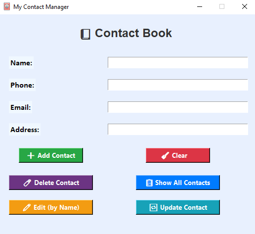
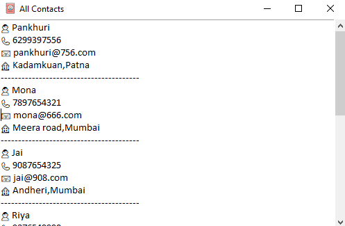

# 📒 Python Contact Book - Tkinter + MySQL

A GUI-based Contact Book application built using *Python Tkinter* and *MySQL*.  
This app allows users to *add, view, delete, and manage contacts* with a user-friendly interface.

---

## 🛠 Features

- ➕ Add New Contact (Name, Phone, Email, Address)
- 🧨 Delete Contact (By Name or Phone)
- 📋 Show All Contacts in New Popup Window
- 🧹 Clear Entry Fields
- 📦 MySQL Database Integration using pymysql
- 🎨 GUI made with Tkinter
- ☁ Fully Git-tracked Project

---

## 📌 Technologies Used

- *Python 3*
- *Tkinter* (GUI)
- *MySQL* (Database)
- *PyMySQL* (Connector)

---

## 🖼 Screenshots

### 🔹 Main GUI

### 🔹 Show All Contacts Popup

